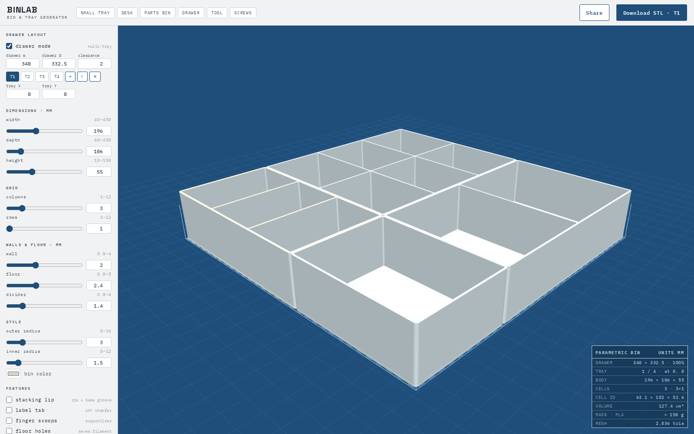

# BinLab — parametric bin & drawer organizer generator



Free, browser-based generator for 3D-printable storage bins and full drawer layouts.
Live 3D preview, watertight binary STL export, no account, no server — the built app
is one HTML file.

**Live demo:** https://chricloud9.github.io/binlab/

## Features

- Fully parametric: dimensions, compartment grid, wall/floor/divider thickness, decoupled outer/inner corner radii
- Stacking lip: trapezoid rim with 45° lead-in chamfers and a matching base groove, so identical trays self-center and interlock
- 45° bottom edge chamfer (hides elephant's foot, slides into drawers), optional interior floor fillets, finger scoops, label tabs, weight-saving floor holes
- **Drawer layout mode**: define your drawer, drag trays with magnetic edge snapping, double-click empty space to auto-fill it with a tray, live overlap/out-of-bounds validation, coverage stats
- Per-tray printer bed fit checking (Bambu, Prusa, Ultimaker, Ender presets)
- Layouts serialize into the URL — the Share button copies a link that reopens your exact design
- Binary STL export per tray, sized exactly, z-up, millimeters

## Build & test

```sh
npm ci          # dev dependency: three@0.128.0 (used only by the tests)
npm test        # geometry + layout suites (plain node:test)
npm run build   # -> dist/index.html
npm run check   # both
```

`dist/index.html` is committed, self-contained apart from the three.js r128 cdnjs
script tag, and opens straight from `file://`. Deployment is the
`.github/workflows/pages.yml` workflow, which publishes `dist/` on every push to
`main` — the repo's Pages source must be set to **GitHub Actions**
(Settings → Pages → Build and deployment → Source).

## Architecture

- **`src/geometry.js`** — the pure geometry engine. `buildParts(params)` turns one
  tray's parameters into named, closed solids (`walls`, `floor`/`collar` or
  `skirt`/`groove`/`center`/`rim`, plus `fillet`, `scoop`, `tab`), with
  `computeStats`, `partVolume`, and binary `exportSTL` alongside. No DOM; its only
  dependency is a global `THREE` for Shape/ExtrudeGeometry plumbing, which is why
  the same file runs unmodified in the browser and under node in the tests.
- **`src/layout.js`** — pure drawer-layout math: overlap tests, next-free-spot
  placement, magnetic drag snapping, largest-empty-rectangle search for
  double-click fill, layout validation messages, and URL-hash
  serialize/parse for the Share feature. No DOM, no three.js.
- **`src/viewer.js`** — everything three.js: scene, lights, ground grid, orbit
  camera, raycast picking and drag-plane math, the empty-space hover highlight,
  and the drawer wireframe. Exposes small functions (`pickTray`, `planePoint`,
  `orbitRotate`, `fitView`, …) so the app layer never touches THREE directly.
- **`src/app.js`** — the wiring: control panel, tray bar, presets, title block,
  printer fit checker, STL download, share links, keyboard handling, and the
  event plumbing between the other three modules.
- **`scripts/build.js`** — ~40-line bundler: concatenates the modules in
  dependency order, strips `import`/`export`, wraps the result in one
  strict-mode IIFE, inlines `src/styles.css` into `src/index.template.html`, and
  writes `dist/index.html` as a classic script (no modules, so `file://` works).

## Design note: no CSG

There is no boolean/CSG library. All solids are closed extrusions and profile
sweeps around per-corner-radius rounded rectangles, overlapped by 0.06 mm.
Every shell is generated watertight with outward winding, and the slicer unions
the overlapping shells on import. This keeps the geometry fast, dependency-free,
and immune to CSG robustness bugs.

The stacking interface: the rim insets 1.15 mm from the outer face, stands
1.8 mm tall, and drops into the base groove with 0.25 mm lateral clearance; a
corner-wall guard auto-raises corner compartment radii so large outer radii
never thin the corner wall below its minimum.

## Printing

Flat side down, no supports. 3 perimeters, 10–15% infill, 0.2 mm layers. PLA on
textured PEI is trouble-free; use PETG for very large flat inserts (300 mm+) to
avoid warp. The exported STL contains overlapping closed shells; every
mainstream slicer (Bambu Studio, PrusaSlicer, Orca, Cura) unions them
automatically on import. If importing into CAD for further booleans, run a mesh
union first.

## Built with Claude

This refactor (monolith → modules + tests) was done with Claude. The geometry
engine is validated by the test suite in `test/`: byte-for-byte STL fixture
comparison across twelve presets, signed-volume watertightness checks, bounding
box and STL structure checks, a lip-mating profile probe, and a raycast
measurement of the corner-wall guard.

## License

MIT. Generated STL files are yours — print, sell, share, no restrictions or attribution required.
